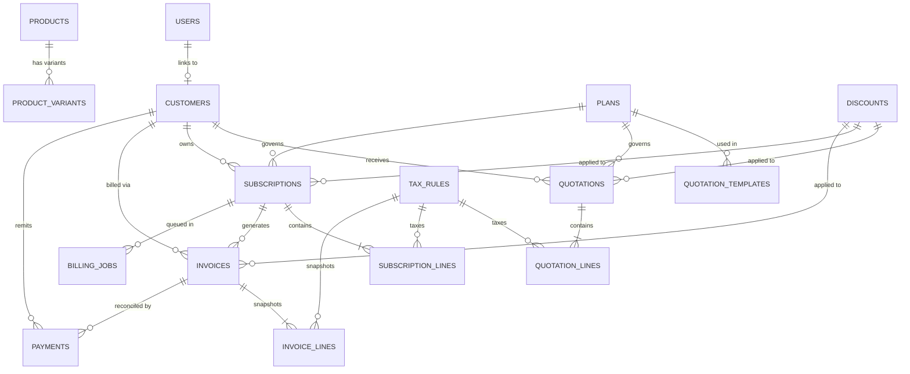
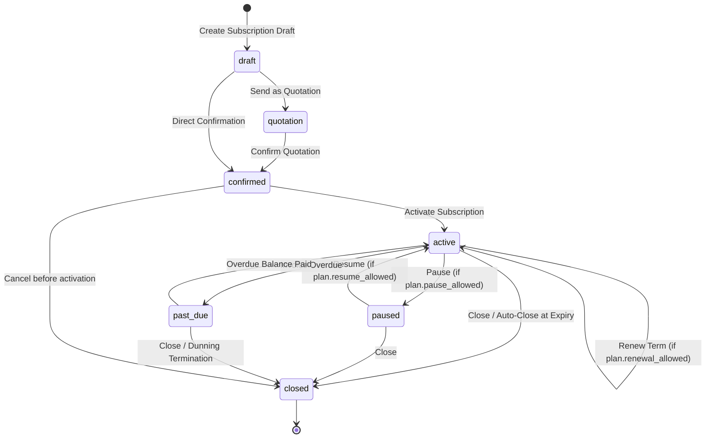
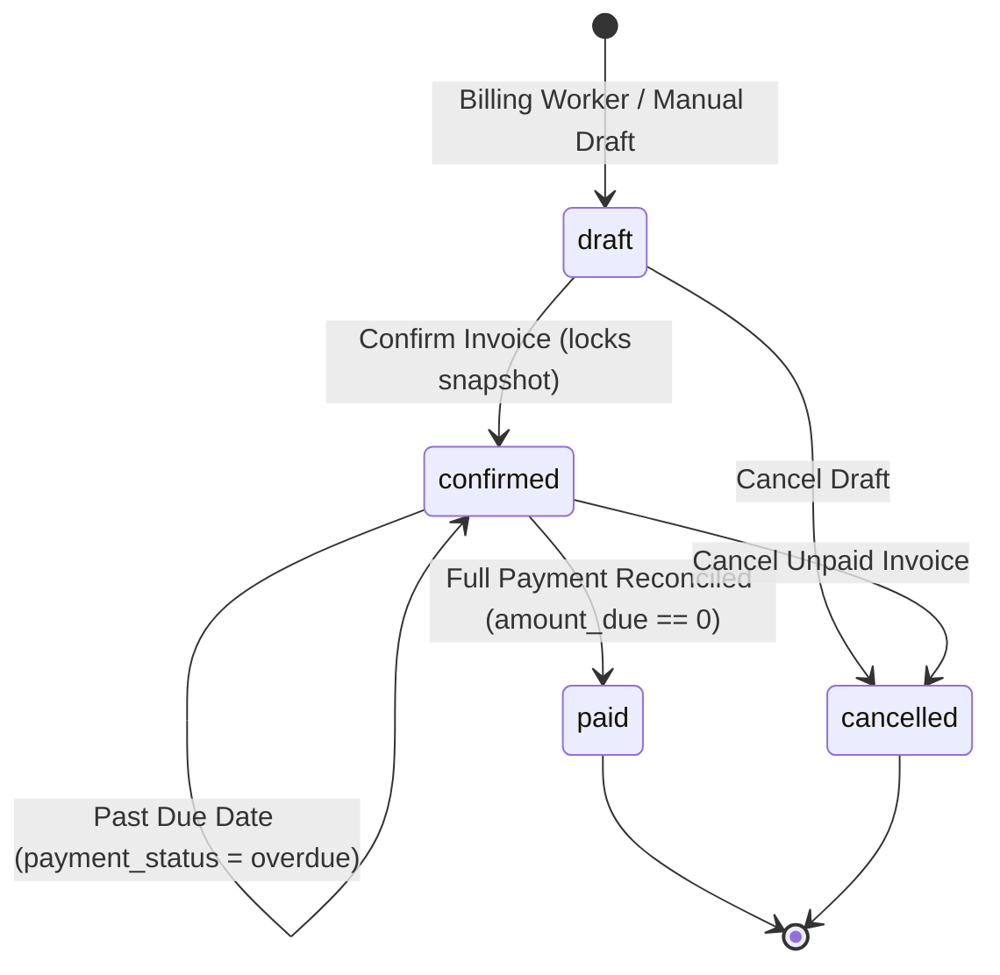

# Database & State Machine Diagrams

## 1. Entity-Relationship (ER) Diagram

```mermaid
erDiagram
    USERS ||--o| CUSTOMERS : "links to"
    CUSTOMERS ||--o{ QUOTATIONS : "receives"
    CUSTOMERS ||--o{ SUBSCRIPTIONS : "owns"
    CUSTOMERS ||--o{ INVOICES : "billed via"
    CUSTOMERS ||--o{ PAYMENTS : "remits"
    PRODUCTS ||--o{ PRODUCT_VARIANTS : "has variants"
    PLANS ||--o{ QUOTATION_TEMPLATES : "used in"
    PLANS ||--o{ QUOTATIONS : "governs"
    PLANS ||--o{ SUBSCRIPTIONS : "governs"
    QUOTATIONS ||--|{ QUOTATION_LINES : "contains"
    SUBSCRIPTIONS ||--|{ SUBSCRIPTION_LINES : "contains"
    SUBSCRIPTIONS ||--o{ INVOICES : "generates"
    SUBSCRIPTIONS ||--o{ BILLING_JOBS : "queued in"
    INVOICES ||--|{ INVOICE_LINES : "snapshots"
    INVOICES ||--o{ PAYMENTS : "reconciled by"
    DISCOUNTS ||--o{ QUOTATIONS : "applied to"
    DISCOUNTS ||--o{ SUBSCRIPTIONS : "applied to"
    DISCOUNTS ||--o{ INVOICES : "applied to"
    TAX_RULES ||--o{ QUOTATION_LINES : "taxes"
    TAX_RULES ||--o{ SUBSCRIPTION_LINES : "taxes"
    TAX_RULES ||--o{ INVOICE_LINES : "snapshots"
```

## 2. Subscription Lifecycle State Machine

```mermaid
stateDiagram-v2
    [*] --> draft : Create Subscription Draft
    draft --> quotation : Send as Quotation
    quotation --> confirmed : Confirm Quotation
    draft --> confirmed : Direct Confirmation
    confirmed --> active : Activate Subscription
    active --> paused : Pause (if plan.pause_allowed)
    paused --> active : Resume (if plan.resume_allowed)
    active --> past_due : Invoice Overdue
    past_due --> active : Overdue Balance Paid
    active --> active : Renew Term (if plan.renewal_allowed)
    active --> closed : Close / Auto-Close at Expiry
    paused --> closed : Close
    past_due --> closed : Close / Dunning Termination
    confirmed --> closed : Cancel before activation
    closed --> [*]
```

## 3. Invoice & Payment Reconciliation Lifecycle

```mermaid
stateDiagram-v2
    [*] --> draft : Billing Worker / Manual Draft
    draft --> confirmed : Confirm Invoice (locks snapshot)
    draft --> cancelled : Cancel Draft
    confirmed --> confirmed : Partial Payment (payment_status = partially_paid)
    confirmed --> confirmed : Past Due Date (payment_status = overdue)
    confirmed --> paid : Full Payment Reconciled (amount_due == 0)
    confirmed --> cancelled : Cancel Unpaid Invoice
    paid --> [*]
    cancelled --> [*]
```

